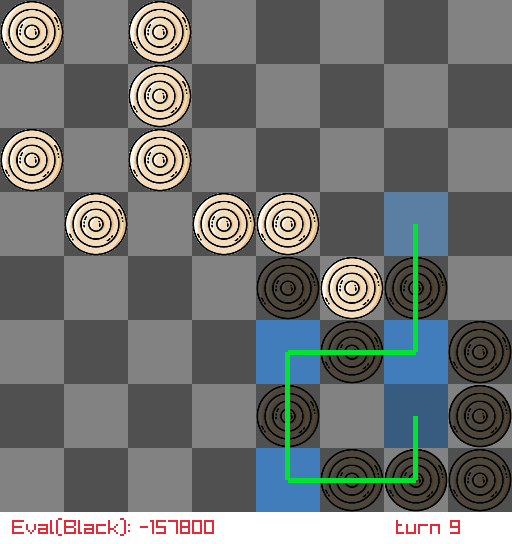

# Ugolki Game

Game rules and basic description can be found here: [Wikipedia article](https://en.wikipedia.org/wiki/Ugolki)

Ugolki solver & game implementation

Game version for 8 by 8 board and 9 pieces

Solver isn't to strong and i (not good in ugolki playing) sometimes can beat them
(Here is a lot more need to be done to make them play like real pro)

Example game position with active move choice for one of black checkers:

Main goal for next update: speedup search / improve pruning
